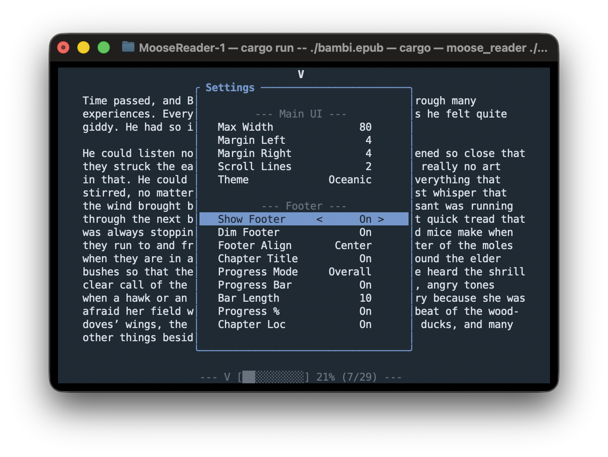

# MooseReader

**A blazingly fast, ultra-lightweight terminal EPUB reader written in Rust.**

MooseReader is a zero-distraction, keyboard-controlled EPUB reader designed for the terminal. Built without heavy TUI frameworks or web-rendering engines to deliver a fast reading experience with low memory profile.



Dedicated to Donkey.

## ✨ Features

* **Featherweight Footprint:** Very low usage of memory (only several MBs).
* **Live Layout Engine:** Dynamically adjust your reading settings on the go.
* **Multiple Themes:** Beautiful, pre-built TrueColor profiles including Dracula, Nord, Solarized, Catppuccin, Gruvbox, etc.
* **Keyboard-Native Navigation:** Keep your hands on the home row with full `h` `j` `k` `l` support.
* **Smart State Persistence:** MooseReader remembers exactly where you left off by using a percentage-based bookmarking.
* **Interactive Table of Contents:** A pop-up TUI pane to seamlessly navigate chapters.
* **Customizable Footer:** Toggle chapter titles, reading progress (chapter vs. overall), percentage read, and visual progress bars `[████░░░░]`. 

## 📖 Usage
Ensure you have [Rust and Cargo](https://www.rust-lang.org/tools/install) installed on your machine.

Then clone and run!
```
git clone https://github.com/YOUR_USERNAME/MooseReader.git
cd MooseReader
cargo run -- ./MyBook.epub
```

## ⌨️ Default Keybindings
|        Key        |             Action             |
|:-----------------:|:------------------------------:|
|      J / Down     |      Scroll down one line      |
|       K / Up      |       Scroll up one line       |
| L / Right / Space | Fast-forward (scroll by chunk) |
|      H / Left     |   Rewind (scroll up by chunk)  |
|        Tab        | Open / Close Table of Contents |
|         S         |       Open Settings Menu       |
|         F         |    Toggle Footer visibility    |
|       Enter       | Select Chapter / Save Settings |
|         Q         |     Save progress and Quit     |


## 🛠️ Configuration
MooseReader automatically creates a reader_config.json file in its cloned directory. It's possible to edit it manually, or simply use the in-program Settings (hotkey: S) menu to change them on the fly. Bookmarks are saved to a local bookmarks.json file.

